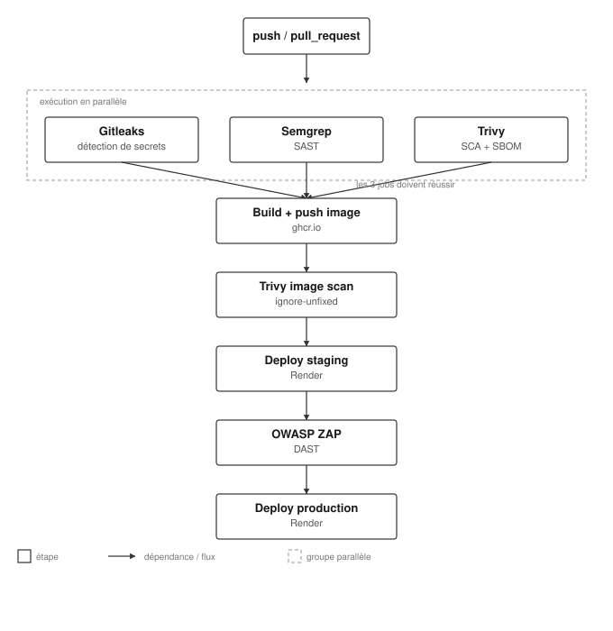

# Secure Pipeline — Pipeline CI/CD sécurisé


Pipeline CI/CD complet intégrant la sécurité à chaque étape (DevSecOps), depuis la détection de secrets jusqu'au déploiement en production, en passant par l'analyse statique du code, l'analyse des dépendances, le scan de l'image Docker et un test dynamique de l'application déployée.

Ce projet a été construit comme labo d'apprentissage pratique pour comprendre en profondeur les outils et les décisions d'architecture qu'un pipeline AppSec/DevSecOps réel doit gérer : ordre des scans, politiques de blocage, gestion des secrets, supply chain security, et build provenance.

## Architecture



Le pipeline suit une logique de "fail fast, fail cheap" : les trois scans les plus rapides et les moins coûteux (détection de secrets, analyse du code, analyse des dépendances) tournent en parallèle. Le build de l'image Docker n'est déclenché que si les trois ont réussi. Chaque étape suivante dépend strictement de la précédente, jusqu'au déploiement en production qui n'intervient qu'après validation du test dynamique sur l'environnement de staging.

## Stack technique

| Catégorie | Outil | Rôle |
|---|---|---|
| Détection de secrets | [Gitleaks](https://github.com/gitleaks/gitleaks) | Détecte les identifiants, clés API et tokens commités par erreur |
| SAST | [Semgrep](https://semgrep.dev) | Analyse statique du code, règles publiques + règle personnalisée |
| SCA | [Trivy](https://github.com/aquasecurity/trivy) | Analyse des dépendances, génération du SBOM (CycloneDX) |
| Scan d'image | [Trivy](https://github.com/aquasecurity/trivy) | Scan des vulnérabilités de l'image Docker construite |
| IaC | [Trivy](https://github.com/aquasecurity/trivy) | Scan de configuration (Dockerfile, manifests) |
| DAST | [OWASP ZAP](https://www.zaproxy.org) | Test dynamique de l'application déployée en staging |
| Registry | [GitHub Container Registry](https://ghcr.io) | Stockage de l'image Docker validée |
| Déploiement | [Render](https://render.com) | Hébergement staging et production |
| CI/CD | GitHub Actions | Orchestration complète du pipeline |
| Application | Python / Flask / Gunicorn | Application de démonstration |

## Détail des étapes du pipeline

### 1. Scans parallèles

**Gitleaks** scanne l'intégralité de l'historique git à la recherche de secrets (clés API, tokens, mots de passe). Toute détection bloque immédiatement le pipeline — un secret qui fuite est toujours considéré comme critique, sans nuance de sévérité.

**Semgrep** analyse le code source avec les règles publiques du registre (`auto`) combinées à une règle personnalisée détectant les identifiants codés en dur (`hardcoded-password-assignment`). Une politique de blocage configurée sur la plateforme Semgrep AppSec définit qu'un finding ne bloque le pipeline que s'il est à la fois de sévérité élevée et de confiance élevée — ce qui réduit les faux positifs bloquants tout en gardant une visibilité complète sur l'ensemble des résultats.

**Trivy SCA** scanne les dépendances du projet à la recherche de CVE connues, et génère en parallèle un SBOM au format CycloneDX, conservé en artifact pour la traçabilité de la supply chain. Le rapport complet (toutes sévérités) est toujours sauvegardé ; seul un sous-ensemble Critical/High déclenche le blocage, calculé explicitement via `jq` plutôt que de filtrer dès la détection — ce choix permet de garder une visibilité totale sur les vulnérabilités moins critiques sans qu'elles bloquent le pipeline.

### 2. Build et push de l'image

L'image Docker est construite une seule fois et poussée vers GitHub Container Registry, taguée à la fois avec le hash du commit (`github.sha`) et `latest`. Ce choix résout un problème de build provenance identifié en cours de projet : sans cette étape, une plateforme de déploiement comme Render reconstruirait sa propre image à partir du code source, rendant caduque tout le travail de scan effectué en amont — l'image testée ne serait jamais l'image réellement déployée.

### 3. Scan de l'image construite

Trivy scanne cette fois l'image Docker elle-même (système de base, paquets installés), pas seulement les dépendances applicatives. Les vulnérabilités sans correctif disponible (`ignore-unfixed`) sont exclues du calcul de blocage — une pratique courante face aux CVE de paquets système pour lesquels aucun patch n'existe encore.

### 4. Déploiement en Staging

Le service Render est configuré en mode "Existing Image" plutôt qu'en connexion directe au dépôt Git, avec l'Auto-Deploy désactivé. Le déploiement est déclenché explicitement par un appel à l'URL de Deploy Hook du service, garantissant que seul ce pipeline contrôle quand et quoi déployer.

### 5. Test dynamique (DAST)

OWASP ZAP exécute un scan baseline contre l'application déployée en staging, à la recherche de vulnérabilités observables uniquement à l'exécution (en-têtes de sécurité manquants, configuration TLS, etc.) — complémentaires à ce que les scans statiques ne peuvent pas détecter.

### 6. Déploiement en Production

Déclenché uniquement après le succès du test ZAP, garantissant qu'aucune version n'atteint la production sans avoir traversé l'intégralité de la chaîne de validation.

## Décisions et compromis techniques

- **Parallélisation des trois premiers scans** plutôt qu'un enchaînement séquentiel strict, pour réduire le temps de feedback développeur sans sacrifier la sécurité (l'étape de build attend la réussite des trois).
- **Visibilité complète, blocage sélectif** : chaque outil de scan produit un rapport exhaustif sauvegardé en artifact, tandis que seul un sous-ensemble de sévérités déclenche un blocage réel — évite qu'une vulnérabilité mineure bloque inutilement un déploiement, sans jamais perdre l'information pour autant.
- **Utilisateur non-root dans le conteneur** (Dockerfile), conformément aux bonnes pratiques de durcissement Docker.
- **Image construite une seule fois, jamais reconstruite par la plateforme de déploiement**, pour garantir que l'image scannée est strictement identique à l'image déployée.
- **Secrets gérés exclusivement via GitHub Secrets**, jamais en dur dans le code ou les fichiers de configuration, avec nettoyage explicite des fichiers `.env` générés en cours de pipeline.

## Limites connues et axes d'amélioration

- Les secrets sont actuellement statiques (GitHub Secrets). Une évolution naturelle serait l'intégration d'un gestionnaire de secrets dédié (HashiCorp Vault ou équivalent) pour la génération dynamique et la rotation automatique.
- Les rapports de chaque outil (Gitleaks, Semgrep, Trivy, ZAP) sont actuellement dispersés en artifacts séparés. Une centralisation via une plateforme ASPM (DefectDojo) permettrait une vue unifiée et un suivi de remédiation dans le temps.
- Le déploiement en production utilise le tag `latest` de l'image plutôt que le SHA exact validé par le pipeline ; une version plus stricte verrouillerait le déploiement sur le SHA précis ayant traversé l'ensemble des contrôles.
- Les tests unitaires et de non-régression applicative ne sont pas encore intégrés au pipeline.

## Lancer le projet en local

```bash
git clone https://github.com/williamWilliam10/secure_pipline.git
cd secure_pipline
docker build -t mini-flask-app .
docker run -p 5000:5000 -e EXTERNAL_API_KEY="valeur-de-test" mini-flask-app
curl http://localhost:5000/check-config
```

## Auteur

William Lowe — [github.com/williamWilliam10](https://github.com/williamWilliam10) · [lowewilliam.com](https://lowewilliam.com)
